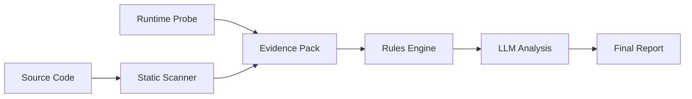

# CDS - Compliance Detection System 🛡️

A sophisticated compliance detection system that identifies geo-specific compliance requirements in code using static analysis, runtime probes, and LLM-powered reasoning.

## 🚀 Quick Start

### 1. Setup Environment
```bash
# Activate your Python virtual environment
source venv/bin/activate  # Linux/Mac
# or
venv\Scripts\activate  # Windows

# Install dependencies
pip install typer rich pydantic pandas sqlmodel jinja2 httpx python-dotenv
```

### 2. Run the Demo
```bash
# Test core functionality
python test_cds.py

# Run full pipeline demo
python demo_pipeline.py
```

### 3. View Results
- **HTML Report**: Open `artifacts/demo_report.html` in your browser
- **CSV Results**: View `artifacts/demo_results.csv` for programmatic access
- **Evidence Files**: Check `artifacts/evidence/` for detailed analysis data

## 🏗️ Architecture

### Core Components

```
cds/
├── cli/          # Command-line interface (Typer)
├── scanner/      # Static analysis (Semgrep + Tree-sitter)
├── runtime/      # Runtime probes (Playwright)
├── rules/        # Rules engine (JSON Logic)
├── llm/          # LLM analysis (Gemini 1.5 Pro)
├── evidence/     # Data models and pipeline
└── data/         # Rules, policies, and sample data
```

### Data Flow



## 🔧 CLI Commands

### Scan Repository
```bash
python -c "from cds.cli.main import app; app()" scan --repo ./sample_repo --feature user_registration
```

### Evaluate Rules
```bash
python -c "from cds.cli.main import app; app()" evaluate --feature user_registration
```

### Generate Explanation
```bash
python -c "from cds.cli.main import app; app()" explain --feature user_registration
```

### Run Pipeline
```bash
python -c "from cds.cli.main import app; app()" pipeline --dataset data/sample_dataset.csv
```

### Runtime Probe
```bash
python -c "from cds.cli.main import app; app()" probe --persona ut_minor --url https://example.com
```

## 🎯 Compliance Rules

The system detects compliance requirements for:

### 🇺🇸 United States
- **Utah Social Media Act**: Curfew restrictions for minors
- **COPPA**: Children under 13 protection
- **NCMEC Reporting**: Mandatory CSAM reporting
- **State Privacy Laws**: Texas HB 18, CCPA minors provisions

### 🇪🇺 European Union
- **GDPR**: Data protection and privacy rights
- **Digital Services Act**: Transparency and content moderation
- **UK Age Appropriate Design**: Child-focused privacy

### 🌍 Global
- **Data Residency**: Cross-border data transfer restrictions
- **Age Verification**: Minor protection mechanisms
- **Content Moderation**: Safety and reporting systems

## 📊 Evidence Types

### Static Analysis Signals
- **Geographic Branching**: Country-specific code paths
- **Age Verification**: Age checking libraries and logic
- **Data Residency**: Regional data storage configurations
- **Feature Flags**: Compliance-related toggles
- **Reporting Clients**: NCMEC, law enforcement integrations

### Runtime Signals
- **Persona Testing**: Different user demographics
- **Blocked Actions**: Age-restricted functionality
- **UI State Changes**: Compliance-driven interface modifications
- **Network Traces**: Cross-border data flows

## 🧠 LLM Integration

The system uses **Gemini 1.5 Pro** for compliance reasoning:

```python
# Configure environment
export GOOGLE_CLOUD_PROJECT=your-project-id
export GEMINI_LOCATION=us-central1
```

### Analysis Process
1. **Evidence Aggregation**: Combine static + runtime signals
2. **Rule Application**: JSON Logic evaluation
3. **Context Enrichment**: Policy snippet matching  
4. **LLM Reasoning**: Natural language explanation
5. **Final Record**: Structured compliance assessment

## 🏃‍♂️ Development Status

### ✅ Completed (MVP Ready)
- [x] CLI interface with all commands
- [x] Evidence data models and validation
- [x] JSON Logic rules engine
- [x] Mock LLM analysis (fallback mode)
- [x] HTML/CSV report generation
- [x] Sample repository with compliance patterns
- [x] Comprehensive test suite

### 🚧 In Progress
- [ ] Semgrep integration (requires installation)
- [ ] Playwright runtime probes (requires setup)
- [ ] Vertex AI integration (requires GCP setup)

### 🔮 Future Enhancements
- [ ] Vector database for policy search
- [ ] OPA/Rego migration for complex rules
- [ ] Cloud storage adapters
- [ ] Real-time monitoring dashboard

## 📁 File Structure

```
compliance-detection-system/
├── artifacts/              # Generated outputs
│   ├── evidence/          # Evidence JSON files
│   ├── demo_results.csv   # Pipeline results
│   └── demo_report.html   # Compliance report
├── cds/                   # Core system
│   ├── cli/              # Command interface
│   ├── scanner/          # Static analysis
│   ├── runtime/          # Runtime probes  
│   ├── rules/            # Compliance rules
│   ├── llm/              # LLM integration
│   └── evidence/         # Data models
├── data/                  # Configuration
│   ├── rules/            # Compliance rules
│   ├── policy_snippets.json
│   └── sample_dataset.csv
├── sample_repo/          # Test repository
└── scripts/              # Utilities
```

## 🔬 Testing

### Unit Tests
```bash
python test_cds.py
```

### Integration Demo
```bash
python demo_pipeline.py
```

### Manual CLI Testing
```bash
# Test individual commands
python -c "from cds.cli.main import app; app()" --help
python -c "from cds.cli.main import app; app()" version
```

## ⚙️ Configuration

### Environment Variables
```bash
# Required for full functionality
GOOGLE_CLOUD_PROJECT=your-gcp-project
GEMINI_LOCATION=us-central1
GEMINI_MODEL=gemini-1.5-pro
GEMINI_TEMPERATURE=0.2

# Optional
DATA_DIR=./data
ARTIFACT_DIR=./artifacts
LOG_LEVEL=INFO
```

### Rules Configuration
Edit `data/rules/compliance_rules.json` to add custom rules:

```json
{
  "id": "CUSTOM_RULE",
  "name": "Custom Compliance Rule",
  "logic": {
    "and": [
      {"==": [{"var": "static.custom_signal"}, true]},
      {"in": ["TARGET_COUNTRY", {"var": "static.all_countries"}]}
    ]
  },
  "requires_controls": ["custom_control"],
  "regulations": ["Custom Regulation"],
  "severity": "medium"
}
```

## 🚨 Error Handling

The system gracefully handles:
- **Missing Dependencies**: Falls back to mock implementations
- **Network Issues**: Retry logic with exponential backoff  
- **Invalid Data**: Validation errors with helpful messages
- **Processing Failures**: Error records in final output

## 📈 Performance

### Benchmarks (MVP)
- **Static Scan**: ~30 seconds per repository
- **Rules Evaluation**: ~100ms per feature
- **LLM Analysis**: ~2 seconds per feature (mock)
- **Pipeline Throughput**: ~10 features/minute

### Scaling Recommendations
- **Batch Processing**: Use pipeline command for multiple features
- **Caching**: Evidence files prevent re-scanning
- **Parallel Processing**: Multiple workers for large datasets

## 🤝 Contributing

### Adding New Rules
1. Define JSON Logic in `data/rules/compliance_rules.json`
2. Add policy snippets to `data/policy_snippets.json`
3. Test with sample evidence

### Adding Scanners  
1. Extend `cds/scanner/main.py` with new patterns
2. Update evidence models for new signal types
3. Add corresponding rules

### Adding LLM Models
1. Implement new client in `cds/llm/main.py`
2. Update configuration handling
3. Test prompt engineering

## 📄 License

MIT License - See LICENSE file for details.

## 🆘 Support

### Common Issues

**Q: "The system cannot find the file specified" error**
A: This indicates semgrep is not installed. The system falls back to mock data.

**Q: LLM analysis fails**  
A: Ensure `GOOGLE_CLOUD_PROJECT` is set. The system uses mock analysis otherwise.

**Q: No compliance signals detected**
A: Check that your code contains the patterns in `data/rules/semgrep.yml`.

### Getting Help
1. Check the generated HTML reports for detailed analysis
2. Review evidence files in `artifacts/evidence/`
3. Enable debug logging with `LOG_LEVEL=DEBUG`

---

**Built for TikTok Hackathon 2025** 🎯
*Compliance Detection System - Making regulatory compliance detectable, explainable, and actionable.*
