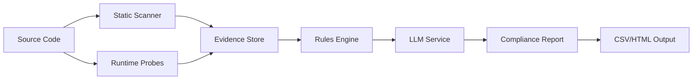

# CDS Documentation Hub

Welcome to the **Compliance Detection System (CDS)** documentation! CDS is an AI-powered MVP that automatically detects geo-specific compliance requirements in code features using static analysis, runtime probes, and LLM reasoning.

## 🚀 Quick Start

**New to CDS?** Get up and running in under 10 minutes:
- **[Quick Start Guide](./guides/quick-start.md)** - One-command demo with sample data
- **[User Manual](./guides/user-manual.md)** - Complete CLI reference and workflows

## 📚 Documentation Navigation

### 🎯 For End Users
| Document | Purpose | Time Investment |
|----------|---------|-----------------|
| [Quick Start Guide](./guides/quick-start.md) | Get CDS running with demo data | 10 minutes |
| [User Manual](./guides/user-manual.md) | Master all CLI commands and workflows | 30 minutes |
| [CLI Reference](./api/cli-reference.md) | Complete command documentation | Reference |

### 🔧 For Developers
| Document | Purpose | Time Investment |
|----------|---------|-----------------|
| [System Architecture](./architecture/system-overview.md) | Understand system design and data flow | 20 minutes |
| [Scanner Engine](./technical/scanner-engine.md) | Deep dive into static analysis capabilities | 30 minutes |
| [Rules Engine](./technical/rules-engine.md) | Compliance rule authoring and evaluation | 30 minutes |
| [LLM Integration](./technical/llm-integration.md) | Gemini integration patterns and best practices | 20 minutes |
| [Data Schemas](./api/data-schemas.md) | Complete schema reference for all data structures | Reference |

### 📖 For Learning
| Document | Purpose | Time Investment |
|----------|---------|-----------------|
| [Adding New Regulations](./tutorials/adding-regulations.md) | Extend compliance coverage step-by-step | 45 minutes |
| [Building Custom Scanners](./tutorials/custom-scanners.md) | Create new static analysis capabilities | 60 minutes |

### 🚀 For DevOps
| Document | Purpose | Time Investment |
|----------|---------|-----------------|
| [Installation Guide](./deployment/installation.md) | Production deployment procedures | 30 minutes |
| [Docker Guide](./deployment/docker-guide.md) | Containerized deployment patterns | 20 minutes |
| [CI/CD Integration](./deployment/ci-cd.md) | Automation and continuous integration | 30 minutes |
| [Contributing Guide](./development/contributing.md) | Developer onboarding and workflow | 20 minutes |

## 🎯 Mission & Scope

The **Compliance Detection System (CDS)** helps development teams:

1. **🔍 Automatically detect** compliance-relevant code patterns using static analysis
2. **🧪 Validate** feature behavior across different geographic personas using runtime probes  
3. **⚖️ Evaluate** compliance requirements using configurable rules engines
4. **🤖 Generate** actionable compliance recommendations using LLM reasoning
5. **📊 Export** evidence and decisions for audit trails and team workflows

### Supported Compliance Areas
- **Geographic Compliance**: Utah Social Media Act, EU Digital Services Act, Regional Privacy Laws
- **Age Protection**: COPPA, Age Verification Requirements, Parental Consent Flows
- **Content Moderation**: NCMEC Reporting, User Safety Controls, Content Review Workflows
- **Data Protection**: GDPR, CCPA, Data Residency Requirements
- **Platform Safety**: Recommendation System Governance, Algorithmic Transparency

## 🏗️ System Architecture Overview

**Core Components:**
- **Scanner**: Static analysis using semgrep + tree-sitter AST
- **Runtime**: Playwright-based geographic persona probes
- **Rules**: JSON-logic compliance evaluation engine
- **LLM**: Gemini 1.5 Pro integration for compliance reasoning
- **Evidence**: SQLite-backed persistence with CSV/HTML export

## 🛠️ Technology Stack

| Component | Technology | Purpose |
|-----------|------------|---------|
| **CLI** | Typer + Rich | User interface and command orchestration |
| **Static Analysis** | Semgrep + Tree-sitter | Code pattern detection and AST analysis |
| **Runtime Probes** | Playwright | Geographic persona testing and behavior validation |
| **Rules Engine** | JSON Logic | Configurable compliance rule evaluation |
| **LLM Integration** | Gemini 1.5 Pro (Vertex AI) | AI-powered compliance reasoning and recommendations |
| **Data Models** | Pydantic v2 | Type-safe evidence and result serialization |
| **Persistence** | SQLModel + SQLite | Evidence storage and audit trails |
| **Export** | Pandas + Jinja2 | CSV data export and HTML report generation |

## 📈 Getting Help & Support

### 🐛 Troubleshooting
- **[Troubleshooting Guide](./guides/user-manual.md#troubleshooting)** - Common issues and solutions
- **[GitHub Issues](https://github.com/your-org/compliance-detection-system/issues)** - Bug reports and feature requests

### 🤝 Contributing
- **[Contributing Guide](./development/contributing.md)** - Development setup and contribution workflow
- **[Code of Conduct](./development/code-of-conduct.md)** - Community standards and expectations

### 📞 Community & Support
- **Slack**: `#compliance-detection-system` channel
- **Office Hours**: Weekly Fridays 2-3pm EST
- **Documentation Issues**: Create [doc improvement requests](https://github.com/your-org/compliance-detection-system/issues/new?template=documentation.md)

## 🔄 Documentation Maintenance

**Last Updated**: December 2024  
**Version**: 1.0.0  
**Next Review**: Q1 2025

This documentation is automatically validated against the codebase. If you find discrepancies:
1. Check the [latest release notes](https://github.com/your-org/compliance-detection-system/releases)
2. Run `cds version` to verify your installation
3. Create a [documentation issue](https://github.com/your-org/compliance-detection-system/issues/new?template=documentation.md)

---

## 🎯 Quick Navigation

**I want to...**
- **Try CDS with sample data** → [Quick Start Guide](./guides/quick-start.md)
- **Use CDS in my project** → [User Manual](./guides/user-manual.md)
- **Understand how CDS works** → [System Architecture](./architecture/system-overview.md)
- **Add new compliance rules** → [Adding Regulations Tutorial](./tutorials/adding-regulations.md)
- **Deploy CDS in production** → [Installation Guide](./deployment/installation.md)
- **Contribute to CDS** → [Contributing Guide](./development/contributing.md)

**Happy Compliance Detection!** 🎉
