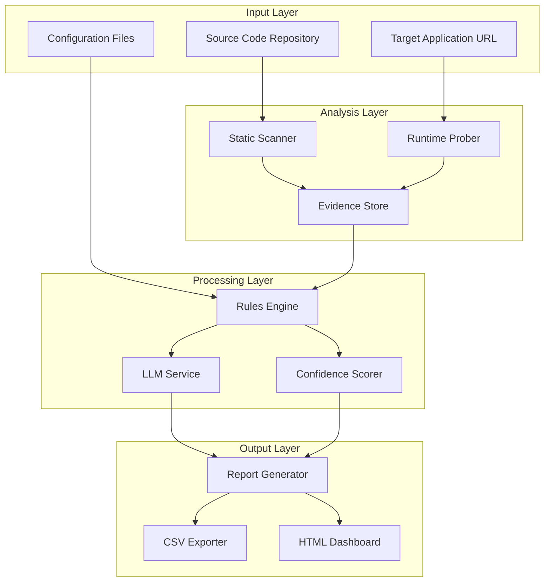
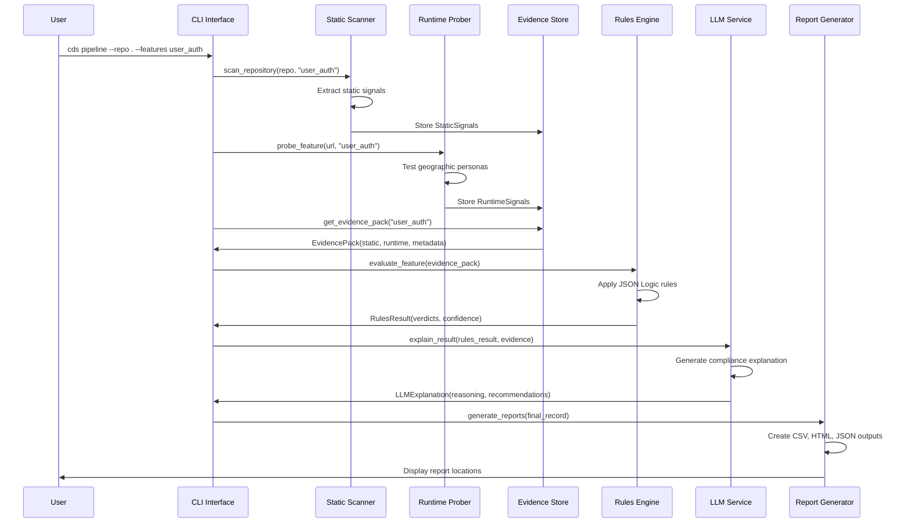

# System Architecture Overview

Comprehensive technical overview of the **Compliance Detection System (CDS)** architecture, component interactions, and design decisions.

## 🏗️ High-Level Architecture



## 🧩 Component Architecture

### 1. **CLI Interface Layer** (`cds.cli`)

**Responsibility**: User interaction, command orchestration, and workflow management

```
cds.cli/
├── main.py          # Typer CLI application with 6 core commands
├── commands/        # Individual command implementations  
│   ├── scan.py      # Static analysis command
│   ├── probe.py     # Runtime probing command
│   ├── evaluate.py  # Rules evaluation command
│   ├── explain.py   # LLM explanation command
│   └── pipeline.py  # End-to-end orchestration
└── formatters/      # Output formatting utilities
    ├── rich_output.py   # Console tables and progress
    └── file_output.py   # File export formatting
```

**Key Design Decisions:**
- **Typer Framework**: Provides type-safe CLI with automatic help generation
- **Rich Integration**: Professional terminal UI with progress bars and tables  
- **Command Isolation**: Each command can run independently or as part of pipeline
- **Streaming Output**: Large analysis results streamed to prevent memory issues

### 2. **Static Analysis Engine** (`cds.scanner`)

**Responsibility**: Extract compliance signals from source code using pattern matching

```
cds.scanner/
├── main.py              # Scanner orchestration and evidence extraction
├── semgrep_scanner.py   # Semgrep-based pattern detection
├── treesitter_scanner.py # AST-based code analysis
├── signal_extractors/   # Specialized signal extraction
│   ├── geo_extractor.py     # Geographic branching patterns
│   ├── age_extractor.py     # Age verification logic  
│   ├── data_extractor.py    # Data residency patterns
│   └── flag_extractor.py    # Feature flag detection
└── rules/               # Static analysis rule definitions
    ├── geo_compliance.yml   # Geographic compliance patterns
    ├── age_safety.yml       # Child safety and age verification
    ├── data_privacy.yml     # Data handling and privacy
    └── custom/              # Organization-specific rules
```

**Architecture Pattern**: **Plugin-based Scanner Architecture**

```python
class StaticAnalysisEngine:
    """Orchestrates multiple scanner implementations"""
    
    def __init__(self):
        self.scanners = [
            SemgrepScanner(rules_dir="data/rules"),
            TreeSitterScanner(languages=["python", "javascript"]),
            FlagScanner(config_paths=["config/", "flags/"])
        ]
    
    def scan_repository(self, repo_path: Path, feature: str) -> StaticSignals:
        """Aggregate signals from all scanner implementations"""
        signals = StaticSignals()
        
        for scanner in self.scanners:
            try:
                scanner_signals = scanner.extract_signals(repo_path, feature)
                signals = signals.merge(scanner_signals)
            except ScannerError as e:
                logger.warning(f"Scanner {scanner.name} failed: {e}")
                continue
                
        return signals
```

**Performance Optimizations:**
- **Parallel Scanning**: Multiple scanners run concurrently  
- **Incremental Analysis**: Skip unchanged files using git diffs
- **Rule Caching**: Compiled semgrep rules cached between runs
- **Memory Streaming**: Large codebases processed in chunks

### 3. **Runtime Probing Engine** (`cds.runtime`)

**Responsibility**: Test application behavior across geographic personas using browser automation

```
cds.runtime/
├── main.py                 # Probe orchestration and evidence collection
├── playwright_prober.py    # Playwright-based browser automation
├── personas/               # Geographic test personas
│   ├── default_personas.json   # Built-in test scenarios
│   └── custom_personas.json    # Organization-specific scenarios
├── probe_strategies/       # Different probing approaches
│   ├── ui_interaction.py       # User interface behavior testing
│   ├── network_trace.py        # Network request analysis  
│   ├── flag_resolution.py      # Feature flag runtime values
│   └── behavior_analysis.py    # User journey validation
└── mock_implementations/   # Development/testing fallbacks
    └── mock_prober.py          # Mock runtime signals for demo
```

**Architecture Pattern**: **Strategy Pattern for Probing**

```python
class RuntimeProbeEngine:
    """Orchestrates geographic persona testing"""
    
    def __init__(self, strategies: List[ProbeStrategy]):
        self.strategies = strategies
        self.personas = self.load_personas()
    
    def probe_feature(self, url: str, feature: str) -> RuntimeSignals:
        """Test feature across multiple geographic personas"""
        signals = RuntimeSignals()
        
        for persona in self.personas:
            persona_signals = self.probe_with_persona(url, feature, persona)
            signals.add_persona_result(persona, persona_signals)
            
        return signals
    
    def probe_with_persona(self, url: str, feature: str, persona: Persona) -> Dict:
        """Execute all probe strategies for given persona"""
        results = {}
        
        with BrowserContext(geo_location=persona.country, locale=persona.language) as browser:
            for strategy in self.strategies:
                try:
                    strategy_result = strategy.execute(browser, url, feature, persona)
                    results[strategy.name] = strategy_result
                except ProbeError as e:
                    logger.warning(f"Probe strategy {strategy.name} failed: {e}")
                    
        return results
```

**Geographic Persona System:**
```json
{
  "personas": [
    {
      "id": "us_utah_minor",
      "country": "US",
      "state": "Utah", 
      "age": 16,
      "language": "en-US",
      "timezone": "America/Denver",
      "test_scenarios": ["registration", "social_features", "content_access"]
    },
    {
      "id": "eu_germany_adult",
      "country": "DE", 
      "age": 25,
      "language": "de-DE",
      "timezone": "Europe/Berlin",
      "gdpr_mode": true,
      "test_scenarios": ["data_collection", "consent_flows", "data_export"]
    }
  ]
}
```

### 4. **Evidence Management System** (`cds.evidence`)

**Responsibility**: Normalize, persist, and manage compliance evidence from all sources

```
cds.evidence/
├── models.py            # Pydantic data models for all evidence types
├── pipeline.py          # Evidence processing and transformation pipeline
├── store.py             # SQLite-based evidence persistence
├── normalizer.py        # Cross-source evidence normalization
├── validators.py        # Evidence quality and completeness validation
├── exporters/           # Evidence export capabilities
│   ├── csv_exporter.py      # Structured CSV export
│   ├── json_exporter.py     # JSON API export
│   └── html_exporter.py     # Human-readable HTML export
└── migrations/          # Database schema versioning
    ├── v1_initial.sql       # Initial evidence schema
    └── v2_add_llm.sql       # LLM analysis integration
```

**Data Model Architecture**: **Domain-Driven Design with Pydantic**

```python
class EvidencePack(BaseModel):
    """Complete evidence collection for a feature"""
    feature_name: str
    repo: Optional[str] = None
    timestamp: datetime = Field(default_factory=datetime.utcnow)
    
    # Static analysis evidence
    static_signals: StaticSignals
    
    # Runtime probing evidence  
    runtime_signals: Optional[RuntimeSignals] = None
    
    # Evidence metadata and provenance
    metadata: EvidenceMetadata
    attachments: List[EvidenceAttachment] = Field(default_factory=list)
    
    def merge(self, other: 'EvidencePack') -> 'EvidencePack':
        """Merge evidence from multiple sources"""
        return EvidencePack(
            feature_name=self.feature_name,
            static_signals=self.static_signals.merge(other.static_signals),
            runtime_signals=self.runtime_signals.merge(other.runtime_signals),
            metadata=self.metadata.merge(other.metadata),
            attachments=self.attachments + other.attachments
        )
    
    def quality_score(self) -> float:
        """Calculate evidence completeness and quality"""
        static_score = len(self.static_signals.all_signals()) / 10.0  # Expected ~10 signals
        runtime_score = 1.0 if self.runtime_signals else 0.0
        metadata_score = 1.0 if self.metadata.is_complete() else 0.5
        
        return min(1.0, (static_score + runtime_score + metadata_score) / 3.0)
```

**Evidence Pipeline Architecture:**

```python
class EvidencePipeline:
    """Processing pipeline for evidence transformation"""
    
    def __init__(self):
        self.processors = [
            SignalNormalizer(),      # Standardize signal formats
            EvidenceValidator(),     # Validate evidence quality
            ConfidenceScorer(),      # Calculate evidence confidence
            AttachmentProcessor(),   # Process code/config attachments
            PersistenceManager()     # Store to SQLite database
        ]
    
    def process(self, evidence: EvidencePack) -> ProcessedEvidence:
        """Execute evidence processing pipeline"""
        current = evidence
        
        for processor in self.processors:
            current = processor.process(current)
            
        return current
```

### 5. **Compliance Rules Engine** (`cds.rules`)

**Responsibility**: Evaluate collected evidence against compliance regulations using configurable rule logic

```
cds.rules/
├── main.py                 # Rules engine orchestration
├── json_logic_engine.py    # JSON Logic rule evaluation
├── confidence_scorer.py    # Rule confidence calculation
├── rule_definitions/       # Compliance rule implementations
│   ├── utah_social_media.json  # Utah Social Media Act rules
│   ├── coppa_compliance.json   # COPPA child protection rules
│   ├── gdpr_article8.json      # GDPR Article 8 (child consent)
│   ├── ncmec_reporting.json    # NCMEC reporting requirements
│   ├── eu_dsa.json             # EU Digital Services Act
│   ├── ca_privacy_act.json     # California Privacy Act  
│   └── au_privacy_act.json     # Australian Privacy Act
├── custom_rules/           # Organization-specific rules
└── rule_validators/        # Rule testing and validation
    ├── rule_tester.py          # Automated rule testing
    └── test_scenarios/         # Test evidence scenarios
```

**Architecture Pattern**: **Rules-as-Data with JSON Logic**

```python
class ComplianceRulesEngine:
    """Evaluate evidence against compliance regulations"""
    
    def __init__(self, rules_dir: Path = Path("data/rules")):
        self.rules = self.load_rules(rules_dir)
        self.evaluator = JsonLogicEvaluator()
        
    def evaluate_feature(self, evidence: EvidencePack) -> RulesResult:
        """Apply all applicable rules to evidence"""
        results = []
        
        for rule in self.rules:
            if self.rule_applies(rule, evidence):
                rule_result = self.evaluate_rule(rule, evidence)
                results.append(rule_result)
                
        return RulesResult(
            feature_name=evidence.feature_name,
            rule_results=results,
            overall_verdict=self.calculate_overall_verdict(results),
            confidence_score=self.calculate_confidence(results)
        )
    
    def evaluate_rule(self, rule: ComplianceRule, evidence: EvidencePack) -> RuleResult:
        """Evaluate single rule against evidence using JSON Logic"""
        try:
            # Convert evidence to JSON Logic data structure
            data = {
                "static": evidence.static_signals.dict(),
                "runtime": evidence.runtime_signals.dict() if evidence.runtime_signals else {},
                "meta": evidence.metadata.dict()
            }
            
            # Apply JSON Logic rule
            verdict = self.evaluator.apply(rule.logic, data)
            confidence = self.calculate_rule_confidence(rule, evidence, verdict)
            
            return RuleResult(
                rule_name=rule.name,
                regulation_id=rule.regulation_id,
                verdict=verdict,
                confidence=confidence,
                evidence_refs=self.extract_evidence_refs(rule, data),
                reasoning=rule.description
            )
            
        except Exception as e:
            logger.error(f"Rule evaluation failed for {rule.name}: {e}")
            return RuleResult(
                rule_name=rule.name,
                verdict="ERROR",
                confidence=0.0,
                reasoning=f"Rule evaluation error: {e}"
            )
```

**Sample Rule Definition** (Utah Social Media Act):
```json
{
  "name": "Utah Social Media Act - Age Verification",
  "regulation_id": "utah_social_media_2024",
  "description": "Utah requires age verification for social media features",
  "jurisdiction": "US-UT",
  "effective_date": "2024-03-01",
  "logic": {
    "if": [
      {"and": [
        {">=": [{"var": "static.geo_branching.length"}, 1]},
        {"in": ["US", {"var": "static.geo_branching.0.countries"}]},
        {">=": [{"var": "static.age_checks.length"}, 1]}
      ]},
      "COMPLIANT",
      {
        "if": [
          {">=": [{"var": "static.age_checks.length"}, 1]},
          "REQUIRES_REVIEW",
          "NON_COMPLIANT"
        ]
      }
    ]
  },
  "confidence_factors": {
    "geo_specificity": 0.3,      # Geographic targeting detected
    "age_verification": 0.4,      # Age verification mechanism present
    "implementation_quality": 0.3  # Quality of implementation
  },
  "priority": "HIGH",
  "references": [
    "https://le.utah.gov/~2024/bills/static/SB0152.html"
  ]
}
```

### 6. **LLM Integration Service** (`cds.llm`)

**Responsibility**: Generate AI-powered compliance explanations and actionable recommendations

```
cds.llm/
├── main.py                    # LLM service orchestration
├── gemini_client.py           # Google Gemini API client
├── prompt_engineering/        # LLM prompt templates and strategies
│   ├── compliance_prompts.py      # Compliance analysis prompts
│   ├── explanation_prompts.py     # Explanation generation prompts  
│   └── recommendation_prompts.py  # Recommendation generation prompts
├── policy_snippets/           # Regulatory text and context
│   ├── utah_social_media.txt      # Utah Social Media Act excerpts
│   ├── coppa_requirements.txt     # COPPA regulatory text
│   ├── gdpr_article8.txt          # GDPR Article 8 text
│   └── ncmec_reporting.txt        # NCMEC reporting requirements
├── response_validators/       # LLM output validation
│   ├── json_validator.py          # JSON schema validation
│   └── content_validator.py       # Content quality validation
└── mock_implementations/      # Development/testing fallbacks
    └── mock_llm.py                # Mock LLM responses for demo
```

**Architecture Pattern**: **Provider Abstraction with Prompt Engineering**

```python
class LLMAnalysisEngine:
    """AI-powered compliance analysis and explanation generation"""
    
    def __init__(self, provider: str = "gemini"):
        self.client = self.create_client(provider)
        self.prompt_manager = PromptManager()
        self.policy_manager = PolicySnippetManager()
        
    def explain_compliance_result(self, rules_result: RulesResult, evidence: EvidencePack) -> LLMExplanation:
        """Generate detailed compliance explanation using LLM"""
        
        # Build context from evidence and rule results
        context = self.build_analysis_context(rules_result, evidence)
        
        # Select relevant policy snippets
        policy_context = self.policy_manager.get_relevant_snippets(
            regulations=[r.regulation_id for r in rules_result.rule_results]
        )
        
        # Generate explanation prompt
        prompt = self.prompt_manager.generate_explanation_prompt(
            context=context,
            policy_context=policy_context,
            analysis_type="compliance_explanation"
        )
        
        # Call LLM with structured output schema
        response = self.client.generate(
            prompt=prompt,
            output_schema=LLMExplanation.model_json_schema(),
            temperature=0.1,  # Low temperature for factual compliance analysis
            max_tokens=4096
        )
        
        # Validate and parse response
        explanation = self.validate_response(response, LLMExplanation)
        
        return explanation
    
    def generate_recommendations(self, explanation: LLMExplanation) -> List[ComplianceRecommendation]:
        """Generate actionable compliance recommendations"""
        
        recommendations_prompt = self.prompt_manager.generate_recommendations_prompt(
            explanation=explanation,
            prioritization_strategy="risk_and_effort_based"
        )
        
        response = self.client.generate(
            prompt=recommendations_prompt,
            output_schema={"type": "array", "items": ComplianceRecommendation.model_json_schema()},
            temperature=0.2  # Slightly higher for creative recommendations
        )
        
        return [ComplianceRecommendation(**rec) for rec in response]
```

**Prompt Engineering Strategy**:
```python
COMPLIANCE_EXPLANATION_PROMPT = """
You are a compliance expert analyzing software features for regulatory compliance.

## Feature Analysis Context
Feature: {feature_name}
Repository: {repo}
Analysis Timestamp: {timestamp}

## Evidence Summary
Static Signals: {static_signals_summary}
Runtime Signals: {runtime_signals_summary}
Evidence Quality Score: {evidence_quality}/1.0

## Rules Evaluation Results
{rules_results_detailed}

## Relevant Regulatory Context
{policy_snippets}

## Task
Generate a comprehensive compliance explanation that includes:

1. **Executive Summary**: Overall compliance posture in 2-3 sentences
2. **Detailed Analysis**: Per-regulation breakdown with evidence references
3. **Risk Assessment**: Identify highest-risk compliance gaps
4. **Actionable Recommendations**: Specific implementation steps with effort estimates

## Output Format
Respond with a JSON object matching this schema:
{output_schema}

## Guidelines
- Reference specific evidence items by type and location
- Distinguish between definitive non-compliance and areas needing review
- Provide concrete, actionable recommendations
- Include effort estimates and priority levels
- Avoid legal advice disclaimers in the technical analysis
"""
```

### 7. **Report Generation System** (`cds.reports`)

**Responsibility**: Transform analysis results into actionable reports for different stakeholder audiences

```
cds.reports/
├── generators/                # Report generation engines
│   ├── csv_generator.py           # Structured data export
│   ├── html_generator.py          # Interactive HTML dashboards
│   ├── json_generator.py          # API-friendly JSON export
│   └── pdf_generator.py           # Executive summary PDFs
├── templates/                 # Report templates
│   ├── html/                      # HTML report templates
│   │   ├── dashboard.html             # Main compliance dashboard
│   │   ├── feature_detail.html        # Per-feature analysis page
│   │   └── regulatory_summary.html    # Regulation-focused view
│   ├── csv/                       # CSV export templates
│   │   └── compliance_export.csv      # Structured compliance data
│   └── email/                     # Email notification templates
│       ├── compliance_alert.html      # High-risk compliance alerts
│       └── weekly_summary.html        # Regular compliance summaries
└── formatters/               # Data formatting utilities
    ├── confidence_formatter.py    # Confidence score visualization
    ├── evidence_formatter.py      # Evidence presentation utilities
    └── recommendation_formatter.py # Recommendation prioritization
```

## 🔄 Data Flow Architecture

### Evidence Collection Flow



### Data Transformation Pipeline

```
Raw Code Files
    ↓ [Static Scanner]
StaticSignals{geo_branching, age_checks, data_residency, flags}
    ↓ [Evidence Normalizer]
EvidencePack{static_signals, runtime_signals, metadata}
    ↓ [Rules Engine]
RulesResult{rule_results[], overall_verdict, confidence_score}
    ↓ [LLM Service]
LLMExplanation{reasoning, recommendations, risk_assessment}
    ↓ [Report Generator]  
FinalRecord{compliance_decision, evidence_summary, llm_analysis}
    ↓ [Export Formatters]
{CSV, HTML, JSON} Outputs
```

## 🔧 Key Design Decisions & Rationale

### 1. **Plugin-Based Scanner Architecture**

**Decision**: Multiple scanner implementations with unified signal extraction interface

**Rationale**:
- **Extensibility**: New scanners (CodeQL, custom AST) can be added without core changes
- **Fault Tolerance**: Failed scanners don't block entire analysis pipeline  
- **Performance**: Scanners can run in parallel for speed optimization
- **Technology Independence**: Not locked into single static analysis tool

**Trade-offs**:
- ✅ **Flexibility**: Easy to add new analysis capabilities
- ✅ **Reliability**: Graceful degradation when tools unavailable
- ❌ **Complexity**: More complex orchestration and error handling
- ❌ **Overhead**: Multiple tool integrations increase dependencies

### 2. **Evidence-Centric Data Model**

**Decision**: All analysis components produce and consume standardized Evidence objects

**Rationale**:
- **Auditability**: Complete evidence trail for compliance decisions
- **Reproducibility**: Same evidence produces same analysis results
- **Incrementalism**: Evidence can be collected across multiple runs
- **Validation**: Evidence quality can be measured and validated

**Implementation**:
```python
class EvidencePack(BaseModel):
    """Immutable evidence collection with provenance tracking"""
    feature_name: str
    static_signals: StaticSignals
    runtime_signals: Optional[RuntimeSignals]
    metadata: EvidenceMetadata
    quality_score: float = Field(computed=True)
    
    class Config:
        frozen = True  # Immutable after creation
        validate_assignment = True
```

### 3. **JSON Logic Rules Engine**

**Decision**: Use JSON Logic for compliance rule definition instead of Python code

**Rationale**:
- **Non-Technical Authors**: Legal/compliance teams can author rules
- **Version Control**: Rules are data, not code - easier to track changes
- **Runtime Safety**: No arbitrary code execution security risks
- **Testability**: Rules can be unit tested with synthetic evidence
- **Portability**: Rules can be shared across organizations

**Sample Rule Complexity**:
```json
{
  "utah_social_media_complete_check": {
    "if": [
      {"and": [
        {">=": [{"var": "static.geo_branching.length"}, 1]},
        {"in": ["US", {"var": "static.geo_branching.0.countries"}]},
        {">=": [{"var": "static.age_checks.length"}, 1]},
        {"or": [
          {">=": [{"var": "runtime.blocked_actions.length"}, 1]},
          {"in": ["age_verification_required", {"var": "runtime.ui_states"}]}
        ]}
      ]},
      "COMPLIANT",
      "REQUIRES_REVIEW"
    ]
  }
}
```

### 4. **Mock-First Development Strategy**

**Decision**: Every external integration has a mock implementation for development

**Rationale**:
- **Developer Experience**: System works immediately after clone
- **Testing**: Comprehensive testing without external dependencies  
- **Demos**: Reliable demonstrations without API keys/network
- **CI/CD**: Tests run in isolated environments
- **Onboarding**: New developers can contribute without complex setup

**Implementation Pattern**:
```python
class ScannerFactory:
    @staticmethod
    def create_semgrep_scanner() -> SemgrepScanner:
        if shutil.which("semgrep"):
            return RealSemgrepScanner()
        else:
            logger.warning("Semgrep not found, using mock implementation")
            return MockSemgrepScanner()
```

### 5. **Confidence-Based Decision Making**

**Decision**: All compliance verdicts include confidence scores and uncertainty handling

**Rationale**:
- **Risk Management**: Low-confidence decisions trigger human review
- **Evidence Quality**: Confidence reflects completeness of evidence
- **Continuous Improvement**: Confidence tracking enables system tuning
- **Stakeholder Trust**: Transparent about analysis limitations

**Confidence Calculation**:
```python
def calculate_rule_confidence(self, rule: ComplianceRule, evidence: EvidencePack, verdict: str) -> float:
    """Multi-factor confidence scoring"""
    
    # Evidence completeness factor (0.0 - 1.0)
    evidence_factor = min(1.0, evidence.quality_score())
    
    # Rule specificity factor (0.0 - 1.0)  
    specificity_factor = rule.specificity_score()
    
    # Pattern match strength factor (0.0 - 1.0)
    match_factor = self.calculate_pattern_match_strength(rule, evidence)
    
    # Combine factors with weights
    confidence = (
        0.4 * evidence_factor +
        0.3 * specificity_factor + 
        0.3 * match_factor
    )
    
    return round(confidence, 2)
```

## 📊 Performance & Scalability Considerations

### Static Analysis Scaling

**Current Performance**:
- **Small Repo** (< 1k files): ~5-10 seconds
- **Medium Repo** (1k-10k files): ~30-60 seconds  
- **Large Repo** (10k+ files): ~2-5 minutes

**Optimization Strategies**:

1. **Incremental Scanning**:
   ```python
   def scan_incremental(self, repo: Path, since_commit: str) -> StaticSignals:
       """Only scan files changed since specified commit"""
       changed_files = get_git_diff(repo, since_commit)
       return self.scan_files(changed_files)
   ```

2. **Parallel Processing**:
   ```python
   async def scan_parallel(self, files: List[Path]) -> List[StaticSignals]:
       """Process files in parallel with controlled concurrency"""
       semaphore = asyncio.Semaphore(CPU_COUNT)
       
       tasks = [self.scan_file_with_semaphore(file, semaphore) for file in files]
       return await asyncio.gather(*tasks)
   ```

3. **Result Caching**:
   ```python
   @lru_cache(maxsize=1000)
   def scan_file_cached(self, file_path: Path, file_hash: str) -> StaticSignals:
       """Cache results by file content hash"""
       return self.scan_file_uncached(file_path)
   ```

### Runtime Probe Scaling

**Geographic Coverage**: 5 personas per feature (US, EU, CA, AU, UK)
**Probe Duration**: ~30 seconds per persona
**Parallelization**: Up to 3 concurrent browser sessions

**Resource Requirements**:
- **Memory**: ~200MB per browser session
- **CPU**: ~50% utilization during active probing
- **Network**: ~1-2MB per probe session

### Evidence Storage Scaling

**SQLite Performance Limits**:
- **Records**: Up to 1M evidence records
- **Storage**: ~100MB for typical enterprise usage
- **Query Performance**: Sub-second for report generation

**PostgreSQL Migration Path**:
```python
# Future: PostgreSQL support for enterprise scale
DATABASE_URL = os.getenv("CDS_DATABASE_URL", "sqlite:///cds.db")

if DATABASE_URL.startswith("postgresql://"):
    engine = create_async_engine(DATABASE_URL, pool_size=20)
else:
    engine = create_engine(DATABASE_URL)  # SQLite fallback
```

## 🔒 Security & Privacy Architecture

### Sensitive Data Handling

**Code Analysis Security**:
- **No Code Execution**: Static analysis only reads files, never executes
- **Sandboxed Tools**: Semgrep runs in isolated subprocess
- **Content Filtering**: Secrets and PII filtered from evidence collection

**Evidence Privacy**:
```python
class EvidenceRedactor:
    """Remove sensitive data from evidence before storage"""
    
    PATTERNS = [
        r'sk-[a-zA-Z0-9]{48}',      # OpenAI API keys
        r'AIza[0-9A-Za-z\\-_]{35}',  # Google API keys  
        r'\b\d{4}[-\s]?\d{4}[-\s]?\d{4}[-\s]?\d{4}\b',  # Credit cards
        r'\b[A-Za-z0-9._%+-]+@[A-Za-z0-9.-]+\.[A-Z|a-z]{2,}\b'  # Emails
    ]
    
    def redact_evidence(self, evidence: EvidencePack) -> EvidencePack:
        """Remove sensitive patterns from evidence"""
        redacted = evidence.copy()
        
        for signal in redacted.static_signals.all_signals():
            signal.message = self.redact_text(signal.message)
            
        return redacted
```

### LLM Integration Security

**API Key Management**:
- **Environment Variables**: No hardcoded API keys
- **IAM Integration**: Google Cloud ADC preferred over service account keys
- **Request Validation**: All LLM requests validated against schema

**Data Transmission**:
- **HTTPS Only**: All LLM API calls use TLS 1.3
- **Request Logging**: API requests logged (without sensitive data)
- **Rate Limiting**: Built-in rate limiting prevents API abuse

### Audit Trail Architecture

**Evidence Provenance**:
```python
class EvidenceMetadata(BaseModel):
    """Complete provenance tracking for compliance audit"""
    collector_version: str = Field(default=__version__)
    collection_timestamp: datetime = Field(default_factory=datetime.utcnow)
    repo_commit: Optional[str] = None
    scanner_versions: Dict[str, str] = Field(default_factory=dict)
    confidence_factors: Dict[str, float] = Field(default_factory=dict)
    validation_results: List[str] = Field(default_factory=list)
```

**Analysis Audit Log**:
```python
class AnalysisAuditLog(BaseModel):
    """Immutable audit record for compliance analysis"""
    analysis_id: str = Field(default_factory=lambda: str(uuid.uuid4()))
    feature_name: str
    timestamp: datetime = Field(default_factory=datetime.utcnow)
    user_id: Optional[str] = None
    evidence_hash: str  # SHA-256 of evidence content
    rules_version: str  # Version of rules applied
    llm_model: Optional[str] = None
    final_verdict: str
    confidence_score: float
    
    class Config:
        frozen = True  # Immutable audit records
```

## 🚀 Extension Points & Plugin Architecture

### Custom Scanner Development

**Scanner Interface**:
```python
class ComplianceScanner(ABC):
    """Abstract base class for all compliance scanners"""
    
    @property
    @abstractmethod
    def name(self) -> str:
        """Scanner identification name"""
        pass
    
    @abstractmethod
    def extract_signals(self, repo_path: Path, feature: str) -> StaticSignals:
        """Extract compliance signals from repository"""
        pass
    
    @abstractmethod  
    def health_check(self) -> bool:
        """Verify scanner is functional"""
        pass
```

**Custom Scanner Example**:
```python
class CustomCodeQLScanner(ComplianceScanner):
    """CodeQL-based compliance pattern detection"""
    
    @property
    def name(self) -> str:
        return "codeql"
    
    def extract_signals(self, repo_path: Path, feature: str) -> StaticSignals:
        """Run CodeQL queries for compliance patterns"""
        
        # Run CodeQL database creation
        db_path = self.create_database(repo_path)
        
        # Execute compliance queries
        results = self.run_queries(db_path, self.compliance_queries)
        
        # Convert to CDS signal format
        return self.convert_results(results, feature)
    
    def health_check(self) -> bool:
        return shutil.which("codeql") is not None
```

### Custom Rules Development

**Rule Authoring Workflow**:
1. **Define Rule Logic**: Create JSON Logic expression
2. **Test Rule**: Use synthetic evidence for testing
3. **Validate Output**: Ensure rule produces expected verdicts
4. **Deploy Rule**: Add to rules directory

```python
# Custom rule testing framework
class RuleTester:
    def test_rule(self, rule: ComplianceRule, test_scenarios: List[TestScenario]):
        """Validate rule behavior across test scenarios"""
        for scenario in test_scenarios:
            evidence = scenario.evidence
            expected = scenario.expected_verdict
            
            actual = self.engine.evaluate_rule(rule, evidence)
            
            assert actual.verdict == expected, f"Rule {rule.name} failed on {scenario.name}"
```

### LLM Provider Extension

**Provider Interface**:
```python
class LLMProvider(ABC):
    """Abstract interface for LLM providers"""
    
    @abstractmethod
    def generate(self, prompt: str, **kwargs) -> str:
        """Generate text completion from prompt"""
        pass
    
    @abstractmethod
    def generate_structured(self, prompt: str, schema: Dict, **kwargs) -> Dict:
        """Generate structured output matching schema"""
        pass
```

**OpenAI Provider Implementation**:
```python
class OpenAIProvider(LLMProvider):
    def __init__(self, api_key: str, model: str = "gpt-4"):
        self.client = OpenAI(api_key=api_key)
        self.model = model
    
    def generate_structured(self, prompt: str, schema: Dict, **kwargs) -> Dict:
        response = self.client.chat.completions.create(
            model=self.model,
            messages=[{"role": "user", "content": prompt}],
            functions=[{"name": "compliance_analysis", "parameters": schema}],
            function_call={"name": "compliance_analysis"},
            **kwargs
        )
        
        return json.loads(response.choices[0].message.function_call.arguments)
```

## 🔄 Future Architecture Evolution

### Microservices Architecture (Phase 2)

**Service Decomposition**:
```
cds-scanner-service      # Static analysis microservice
cds-runtime-service      # Runtime probing microservice  
cds-rules-service        # Compliance evaluation service
cds-llm-service          # LLM integration service
cds-evidence-service     # Evidence management service
cds-api-gateway          # API gateway and orchestration
```

### Real-time Compliance Monitoring (Phase 3)

**Event-Driven Architecture**:
```python
class ComplianceEventProcessor:
    """Process real-time compliance events"""
    
    async def handle_code_commit(self, event: CodeCommitEvent):
        """Analyze code changes for compliance impact"""
        changed_files = event.changed_files
        affected_features = self.identify_affected_features(changed_files)
        
        for feature in affected_features:
            analysis_task = AnalysisTask(
                feature=feature,
                trigger="code_commit",
                priority="HIGH" if self.is_compliance_critical(feature) else "MEDIUM"
            )
            await self.queue_analysis(analysis_task)
```

### ML-Enhanced Rules Engine (Phase 4)

**Machine Learning Integration**:
```python
class MLEnhancedRulesEngine(ComplianceRulesEngine):
    """Rules engine with ML confidence prediction"""
    
    def __init__(self):
        super().__init__()
        self.confidence_model = self.load_confidence_model()
        self.pattern_detector = self.load_pattern_model()
    
    def predict_confidence(self, rule: ComplianceRule, evidence: EvidencePack) -> float:
        """Use ML model to predict rule confidence"""
        features = self.extract_ml_features(rule, evidence)
        return self.confidence_model.predict(features)[0]
```

---

**📝 Last Updated**: December 2024  
**🏗️ Architecture Version**: 1.0  
**🔄 Next Review**: Q1 2025

This architecture documentation provides the technical foundation for understanding, extending, and maintaining the CDS system. For implementation details, see the [Technical Specifications](../technical/) section.
